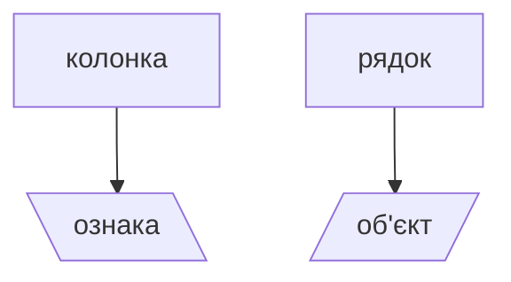

## Групове заняття № 5
### *Тема 2:* Робота з масивами даних
### *Заняття 11:* Pandas. Фільтрування даних

>[!info] Обговорена та ухвалена на засіданні кафедри інформаційних технологій та кібербезпеки 16 лютого 2026 р., протокол № 07

### Результати заняття
*(слухач зможе)*
1. Вміти пояснити порядок фільтрування даних за допомогою бібліотеки `pandas`.
2. Описати підходи до побудови умовних виразів для фільтрування даних. 

**Навчальний час**: 2 години.

**Навчальна література:**
1. Pandas documentation [Електронний ресурс] – Режим доступу до ресурсу: https://pandas.pydata.org/docs/.
2. Pandas Introduction [Електронний ресурс] – Режим доступу до ресурсу: https://www.w3schools.com/python/pandas/pandas_intro.asp.

**Технічні засоби навчання:**
1. Клас ПЕОМ.
2. Локальна мережа.

<h3 align='center'>ПЛАН ЗАНЯТТЯ</h3>

|  №  | Навчальні питання                                          | Час, хв |
| :-: | ---------------------------------------------------------- | :-----: |
|  1  | ВСТУПНА ЧАСТИНА <br>Організаційні питання<br>              |    5    |
|  2  | ОСНОВНА ЧАСТИНА                                            |   80    |
|     | [[#1. Фільтрування даних на основі простих висловлювань]]  |   40    |
|     | [[#2. Фільтрування даних на основі складних висловлювань]] |   30    |
|     | [[#3. Перевірка теоретичних знань]]                        |   10    |
|  3  | ЗАКЛЮЧНА ЧАСТИНА                                           |    5    |
|     | [[#Порядок оцінювання]]                                    |         |
|     | [[#Завдання на самостійну підготовку]]                     |         |
|     | [[#Питання для самоконтролю]]                              |         |

<h3 align='center'><strong>ВСТУПНА ЧАСТИНА</strong></h3>

Організаційні питання.


<h3 align='center'><strong>ОСНОВНА ЧАСТИНА</strong></h3>

### 1. Фільтрування даних на основі простих висловлювань
*Теорія - 10 хв, практика - 30 хв*

На попередньому занятті було розглянуто можливість фільтрування даних - як вибірку частини даних, за допомогою індексів. При цьому розглядалися як числові, так і іменовані індекси.
Але коли є велика кількість даних більш доцільним є їх вибірка *за умовою*, або логічним висловлюванням (*conditional filtering*).
Такий процес дозволяє відібрати необхідні рядки масиву даних, шляхом накладення умов на стовпці.
Тут важливим є структурування даних.



<p align='center'>Рис. 1.1</p>

Кожна колонка розглядається як **ознака** (*features*), що можна розглядати як виокремлена характеристика або властивість.

Кожен рядок є **об'єктом**, який описується певним набором характеристик, властивостей. Наприклад:

| Країна  | Проголошення незалежності | Населення | Валовий внутр. продукт |
| ------- | ------------------------- | --------- | ---------------------- |
| США     | 1776                      | 328       | 20,5                   |
| Україна | 1991                      | 39        | 0,7                    |
| Мексика | 1821                      | 126       | 1,22                   |
| Канада  | 1867                      | 38        | 1,7                    |

Як правило, використовують саме таку форму для аналізу даних:

- **стовпці** - ознаки (характеристики, властивості, атрибути);
- **рядки** - екземпляр об'єкту даних.

У випадку коли дані надійшли у іншій формі, шляхом транспонування можливо привести до зазначеної вище.
Розглянемо приклад набору даних.

```python
import pandas as pd

data = [
    ['США', 1776, 328,20.5],
['Україна', 1991,39,0.7],
['Мексика', 1821,126,1.22],
['Канада', 1867,38,1.7]
]

features = ['Країна', 'Проголошення незалежності', 'Населення', 'Валовий внутр. продукт']

df_1 = pd.DataFrame(data=data)
print(df_1.head())
```

```powershell
         0     1    2      3
0      США  1776  328  20.50
1  Україна  1991   39   0.70
2  Мексика  1821  126   1.22
3   Канада  1867   38   1.70
```

Таким чином, набір даних, що надано як список списків, при створенні екземпляра об'єкта `DataFrame` матиме наступний вигляд - індекси стовпців та рядків числові.
Для приведення їх у рекомендовану форму для аналізу проведемо наступні дії:
	- асоціювання списку назв характеристик (`features`) з стовпцями;
	- визначення стовпця, що матиме унікальний індекс - назви екземплярів об'єктів даних.

```python
features = ['Країна', 'Проголошення незалежності', 'Населення', 'Валовий внутр. продукт']
df_2 = pd.DataFrame(data, columns=features)
df_2.set_index('Країна')
```
```powershell
    Країна  Проголошення незалежності  Населення  Валовий внутр. продукт
0      США                       1776        328                   20.50
1  Україна                       1991         39                    0.70
2  Мексика                       1821        126                    1.22
3   Канада                       1867         38                    1.70
```

>[!note] Важливо пам'ятати, що такі операції не вносять зміни у вихідний набір даних, а повертають результат операції

Для того щоб залишити зміни необхідно:
	- повторно присвоїти цій же змінній результат операції `df = df.set_index('name_column')`;
	- використати аргумент у методі `df.set_index('name_column', inplace=True)`.

#### 🧠Практичне завдання 1
> 1. Привести до визначеної для аналізу даних форми набір даних
>  `data = {'США': [1776, 328,20.5], 'Україна': [1991,39,0.7], 'Мексика': [1821,126,1.22],    'Канада': [1867,38,1.7]}`
> 
> TechStack: python;pandas;
> Макс. бал: 0.4 / Час, хв: 15

Привівши набір даних у формат зручний для подальшої роботи вирішимо завдання фільтрування. Наприклад, які країни мають населення більше 100 млн. Для цього достатньо обрати відповідний стовпець та задати умову

```python
df_2['Населення'] > 100
```
```powershell
0     True
1    False
2     True
3    False
Name: Населення, dtype: bool
```

Результатом такої операції є об'єкт `Series` з бульовими значеннями, як результат логічної операції для кожної чарунки.
Для отримання рядків з набору даних необхідно записане вище висловлювання помістити у квадратні дужки змінної, що посилається на екземпляр об'єкта `DataFrame`

```python
df_2[df_2['Населення'] > 100]
```
```powershell
    Країна  Проголошення незалежності  Населення  Валовий внутр. продукт
0      США                       1776        328                   20.50
2  Мексика                       1821        126                    1.22
```

#### 🧠Практичне завдання 2
> 1. Завантажити файл з постами у форматі JSON за [посиланням](https://jsonplaceholder.typicode.com/comments)
> 2. Провести підрахунок кількості символів стовпця 'name'.
> 3. Додати такий стовпець до набору даних.
> 4. Отримати вибірку постів, заголовок яких менше 20 символів.
>
> TechStack: python;pandas;
> Макс. бал: 0.4 / Час, хв: 15

### 2.  Фільтрування даних на основі складних висловлювань
*Теорія - 10 хв, практика - 20 хв*

Як правило, до вибірки потрібно застосувати кілька умов. Для цього необхідно застосувати знання із дискретної математики, що дозволять сформулювати відповідні висловлювання.

Для подальшого використання під терміном **висловлювання** будемо розуміти розповідне речення, яке на даний момент часу може бути оцінено як істинне або хибне. Наприклад: "Я військовослужбовець Збройних Сил України." Таке речення є *простим висловлюванням*.

Розглянемо деякі положення із дискретної математики, що описують у математичних термінах поєднання кількох умов в одне висловлювання. Пов'язані прості висловлювання формують *складне висловлювання*. Введені наступні типи зв'язків між простими висловлюваннями.

1. **Кон'юнкція** - висловлювання істинне тоді коли обидва висловлювання істинні. Позначення - $ p \wedge q $.
2. **Диз'юнкція** - висловлювання істинне тоді коли істинне хоча б одне висловлювання. Позначення - $ p \vee q $.
3. **Заперечення** - висловлювання, яке є інверсією, тобто при хибності висловлювання результат - істина. Позначення - $ !p $.

Так доповнивши практичне завдання 2 ще однією умовою, наприклад щоб населення не перевищувало 200 млн, отримаємо висловлювання із двох складових:
	- df_2['Населення'] > 100;
	- df_2['Населення'] < 200.

Поєднати умови можна двома логічними операторами:
	- `&` - логічне **"ТА"** (_кон'юнкція_),
	- `|` - логічне **"АБО"** (_диз'юнкція_).

Таблиця відповідності є наступною:

| Висловлювання | Результат | Висловлювання  | Результат |
| :-----------: | :-------: | :------------: | :-------: |
|  True & True  | **True**  |  True \| True  |   True    |
| False & True  |   False   | False \| True  |   True    |
| True & False  |   False   | True \| False  |   True    |
| False & False |   False   | False \| False | **False** |

Слід зазначити, що поєднуватися умови можуть дві і більше. Тому узагальненням правила для цих логічних операторів є:
	- для кон'юнкції - висловлювання буде **істинним** тільки тоді коли **усі** умови **істинні**;
	- для диз'юнкції - висловлювання буде **хибним** тільки тоді коли **усі** умови **хибні**.

Для поєднання двох простих висловлювань у складне висловлювання застосовується наступний синтаксис:

```python
df_2[(df_2['Населення'] < 100) | (df_2['Населення'] >200 )]
```
```powershell
    Країна  Проголошення незалежності  Населення  Валовий внутр. продукт
0      США                       1776        328                    20.5
1  Україна                       1991         39                     0.7
3   Канада                       1867         38                     1.7
```

Прості висловлювання записуються у круглих дужках, і між ними ставиться операнд `&` або `|`, в залежності від логіки висловлювання.  
Ці операнди відрізняються від класичних Python, оскільки тут вони застосовуються для реалізації операцій `broadcasting`.

#### 🧠Практичне завдання 3
> 1. Завантажити файл з постами у форматі JSON за [посиланням](https://jsonplaceholder.typicode.com/comments)
> 2. Відфільтрувати повідомлення, які мають кількість символів стовпця 'name' від 10 до 40.
> 3. Додати до умови 2 умову щодо необхідності закінчення електронної адреси символами '.biz'.
> 4. Додати умову, яка буде враховувати домен електронної пошти або `biz` або `.tv`.
>
> TechStack: python;pandas;
> Макс. бал: 0.5 / Час, хв: 20

### 3.  Перевірка теоретичних знань
*Теорія - 10 хв, практика - 0 хв*

[Посилання на тести]()

<h3 align='center'><strong>ЗАКЛЮЧНА ЧАСТИНА</strong></h3>

##### Завдання на самостійну підготовку
1. Опрацювати питання, що були розглянуті на груповому занятті.
2. Практичні питання опрацювати у редакторі коду.
3. Пройти тести для самоконтролю.

##### Питання для самоконтролю
[Посилання на тести]()


### Порядок оцінювання
Відповідно до РПНД на груповому занятті № 3 слухач може отримати максимально **2 бали** за 100 бальною шкалою оцінювання даної дисципліни. При цьому, 
- за контрольне опитування - **0.7 балів**, 
- за виконання практичних завдань - **1.3 бали**.

Контрольне опитування складається з 7 тестових питань, неправильна / відсутня відповідь на питання тесту знижує загальний бал на **0.1**. 

При виконанні практичних завдань нарахування балів розподіляється наступним чином:

| практичне завдання |  бали   |
|:------------------:|:-------:|
|         1          |   0.4   |
|         2          |   0.4   |
|    3          |   0.5   |
|     **Всього**     | **1.3** |

>[!warning] За порушення академічної доброчесності за рішенням викладача може бути знято до 0,5 балів.

Виставлення оцінок в журнал успішності за національною шкалою проводиться за критеріями, що визначені у таблиці

| Оцінка          |    5    |     4     |     3     |    2    |
| --------------- | :-----: | :-------: | :-------: | :-----: |
| Кількість балів | [2;1,8] | (1,8;1,3] | (1,3;1,0] | (1,0;0] |

